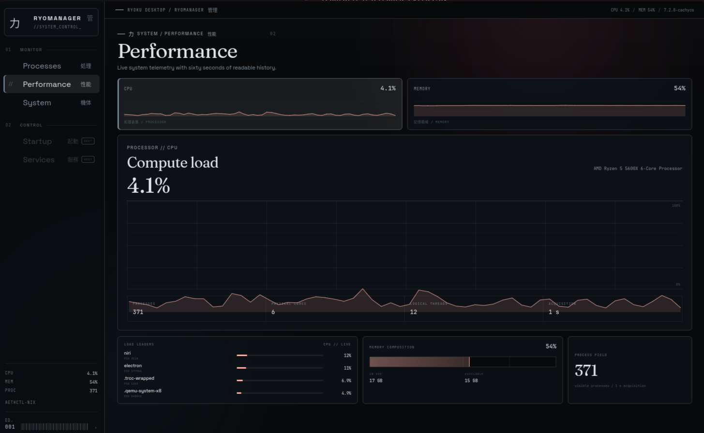
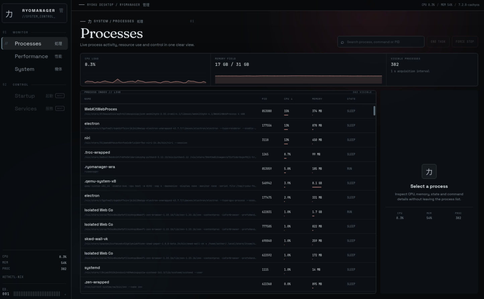
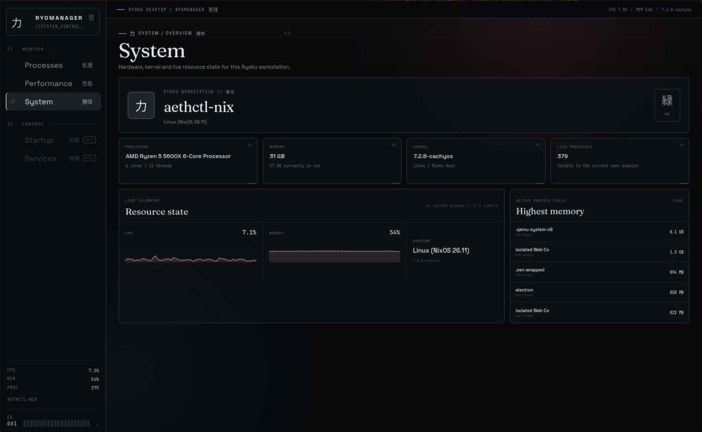

# RyoManager

# RyoManager

<p align="center">
  
</p>

## Screenshots

<p align="center">
  
  
</p>

## Development

RyoManager uses Wails 2, Go, Svelte 5 and Vite. The frontend lives in `frontend/`; the native Linux collector and process controls are implemented in Go.

```sh
nix develop
wails dev
```

Frontend checks:

```sh
cd frontend
npm ci
npm run check
npm run build
```

Go backend check:

```sh
go test ./...
```

Production build:

```sh
wails build
```
